<h1 align="center">Covid Test Booking</h1>

Covid-19 test booking application built with `Flutter`. I followed a design found [here](https://www.sketchappsources.com/). Unfortunetely the design are not complete and only the first option in menu are available.

This was my first time using `Figma` to collect design details and all images and icons used to built it. `Figma` is amazing and unlock a group of infinite possiblities to implement faithfully UIs.

<p align="center">
  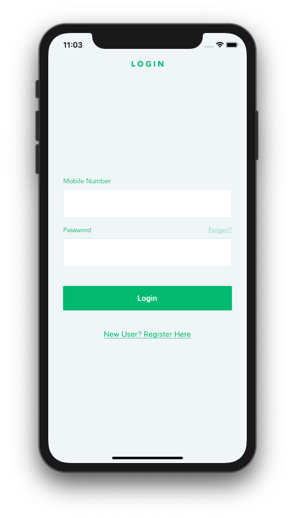
  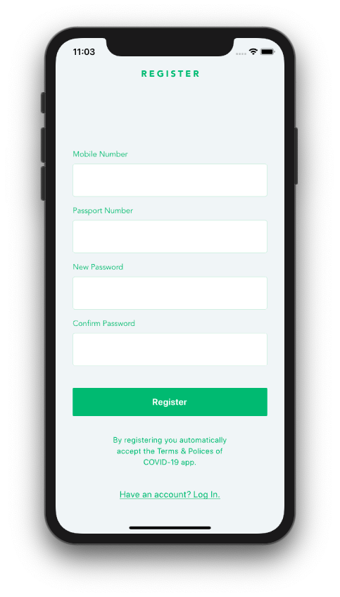
  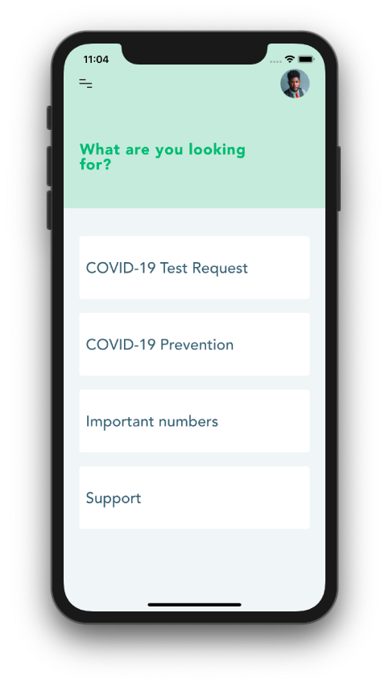
  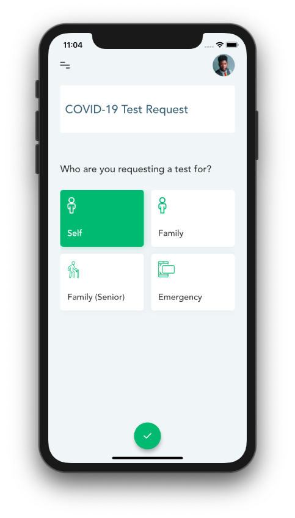
</p>
<p align="center">
  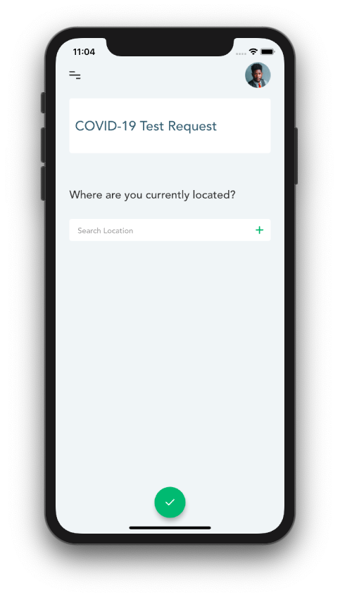
  
  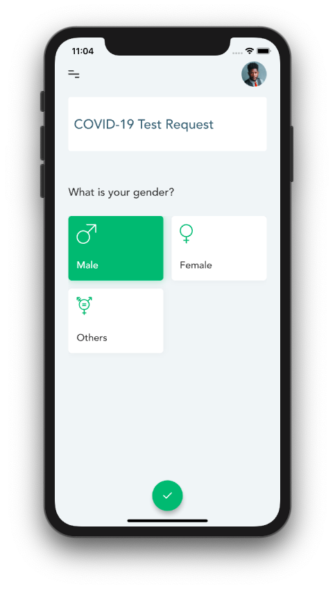
  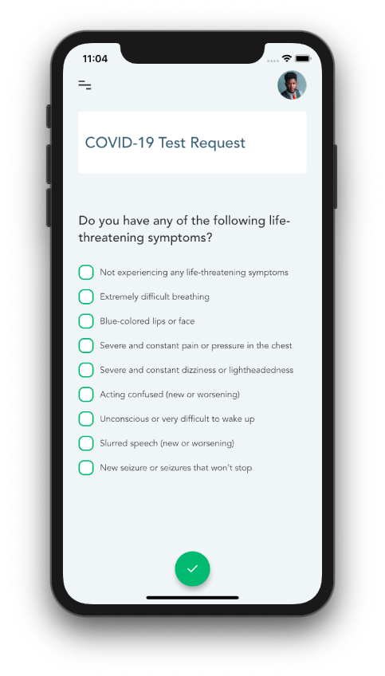
</p>
<p align="center">
  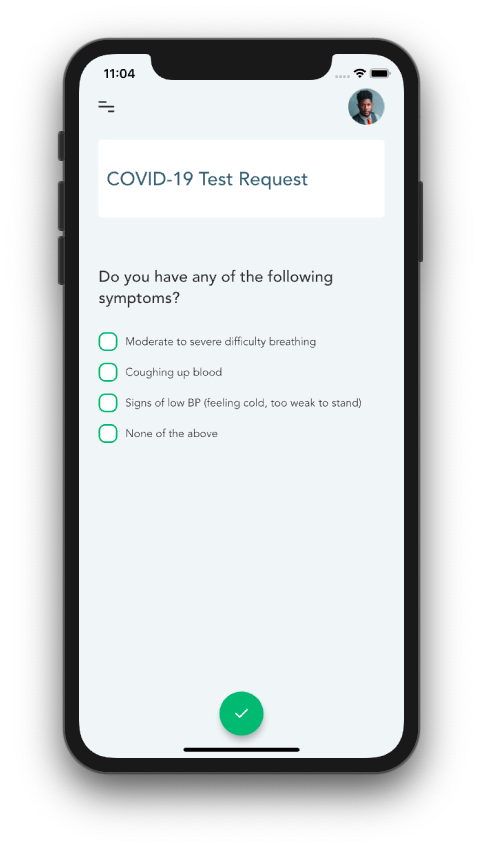
  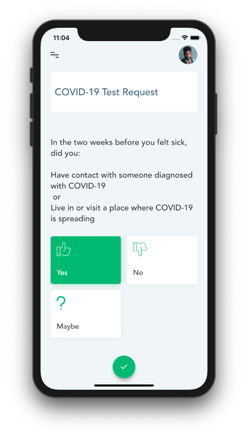
  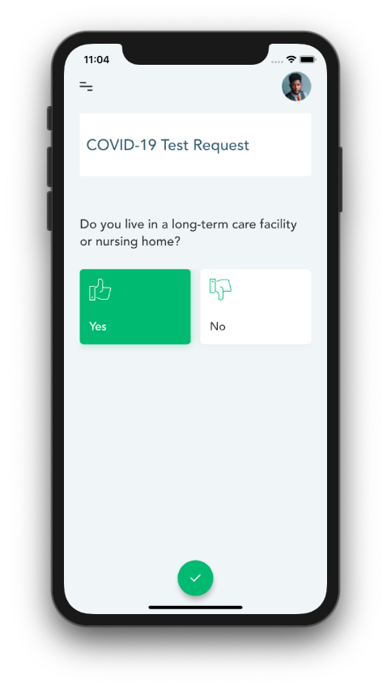
  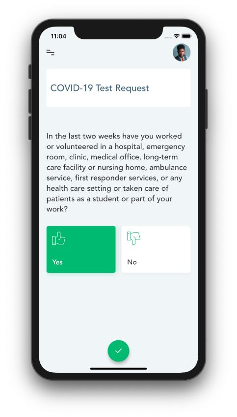
</p>
<p align="center">
  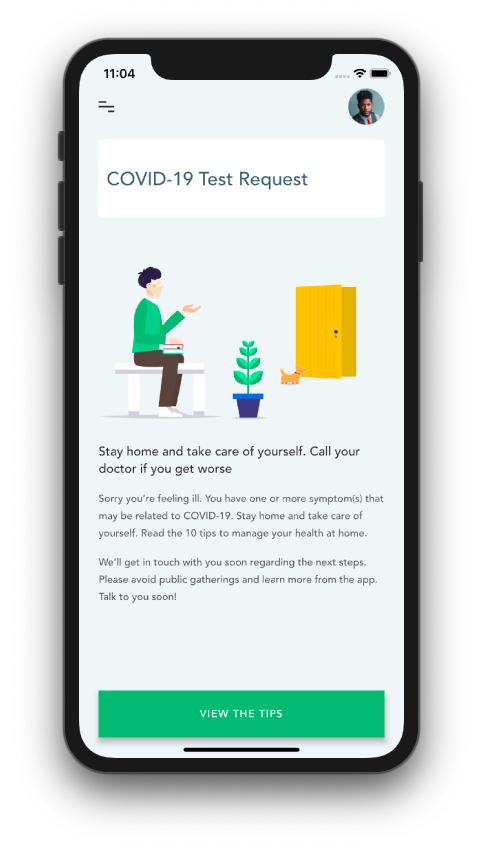
</p>

## How to use

To clone and run this application, you'll need [Git](https://git-scm.com/downloads) and [Flutter](https://flutter.dev/docs/get-started/install) installed on your computer. From your command line:

```
# Clone this repository
$ git clone https://github.com/feMoraes0/covid-test-booking.git

# Go into the repository
$ cd covid-test-booking

# Install dependencies
$ flutter packages get

# Run the app
$ flutter run
```

## Design
 - [COVID-19 Test Booking App Sketch Resource](https://www.sketchappsources.com/free-source/4363-covid-19-test-booking-app-sketch-freebie-resource.html)

## Contact
  - <a target="_blank" href="https://www.linkedin.com/in/fernando-moraes-48a26916a/">LinkedIn</a>
  - <a target="_blank" href="mailto:fernandomoraes.lopes@gmail.com">E-mail</a>
